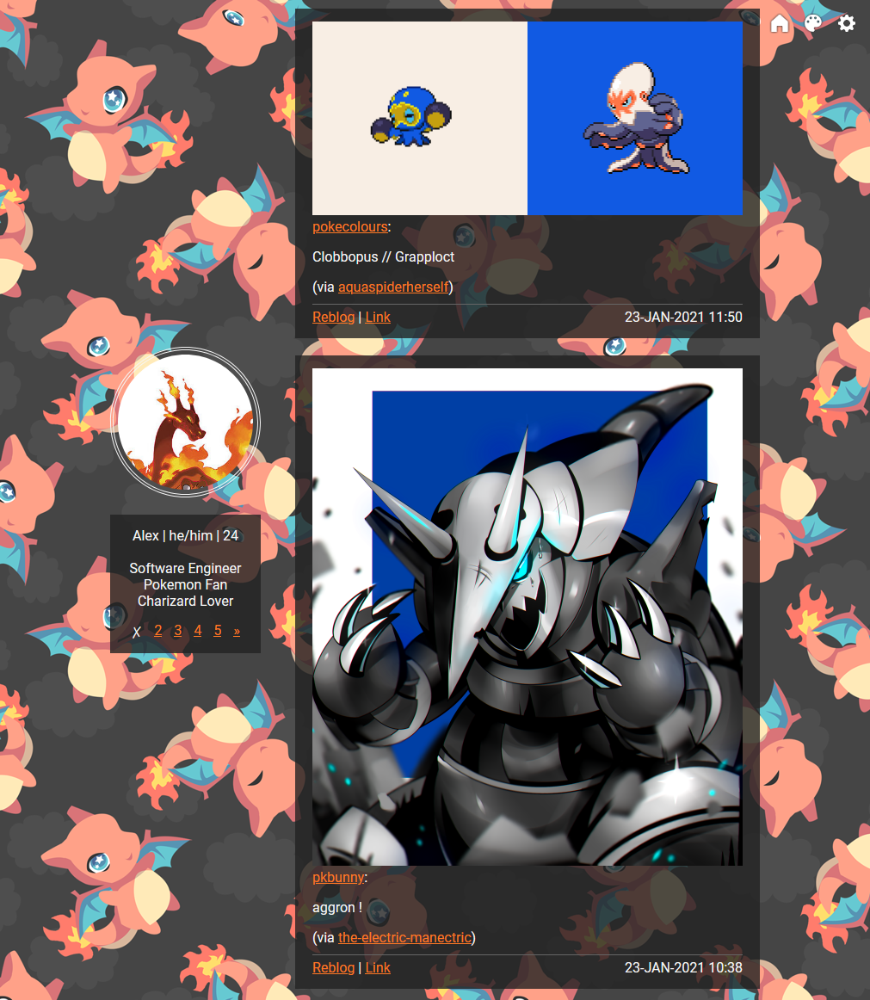
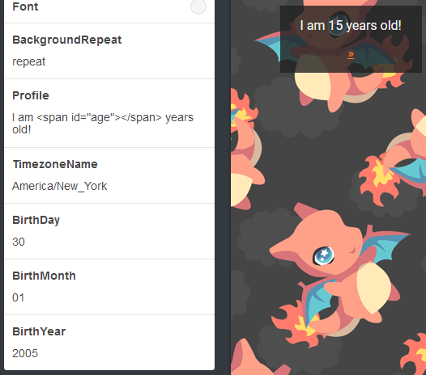

# Basic Tumblr Theme

## Usage
1. Copy entire contents of [index.html](./index.html) into your theme HTML.
2. Set colors, sidebar image, and other options. [How do I display my age?](#age-setup)
3. Tinker?

### Age Setup
If you would like to display your age there are a few things you need to do.

1. Add this span html to your profile text box ``
2. Set your birth day, month, and year (with leading zeroes! eg. 02, 09, 2005)
3. Add your timezone name (`America/New_York`). [Find TZ Database Name](https://en.wikipedia.org/wiki/List_of_tz_database_time_zones)

When you are done it should look this!

